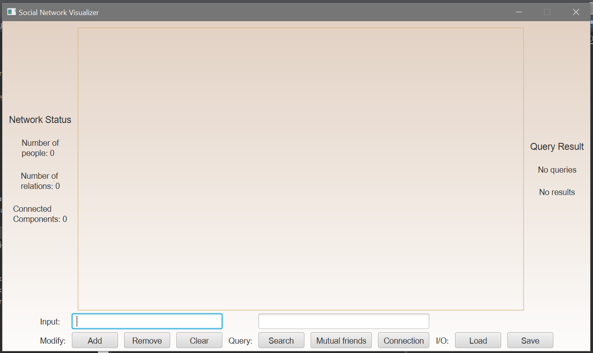
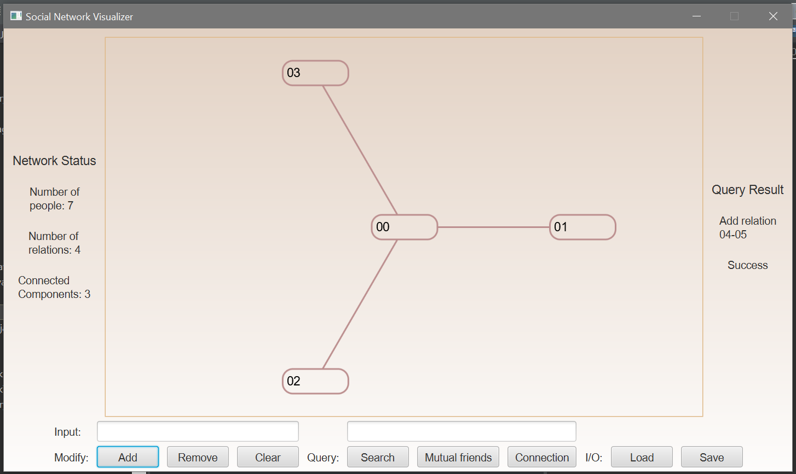
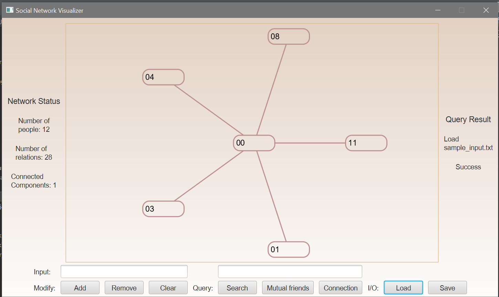
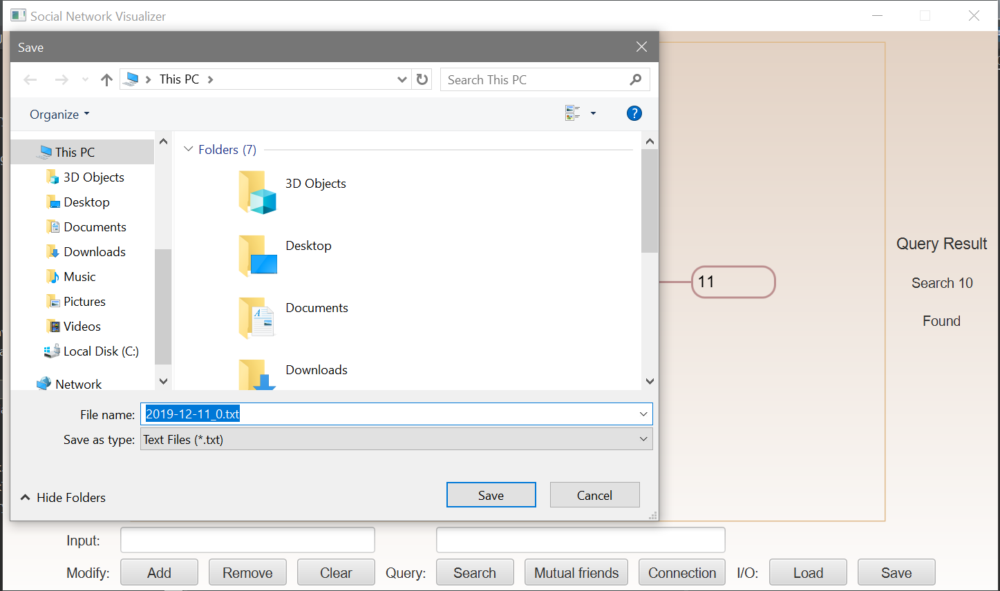
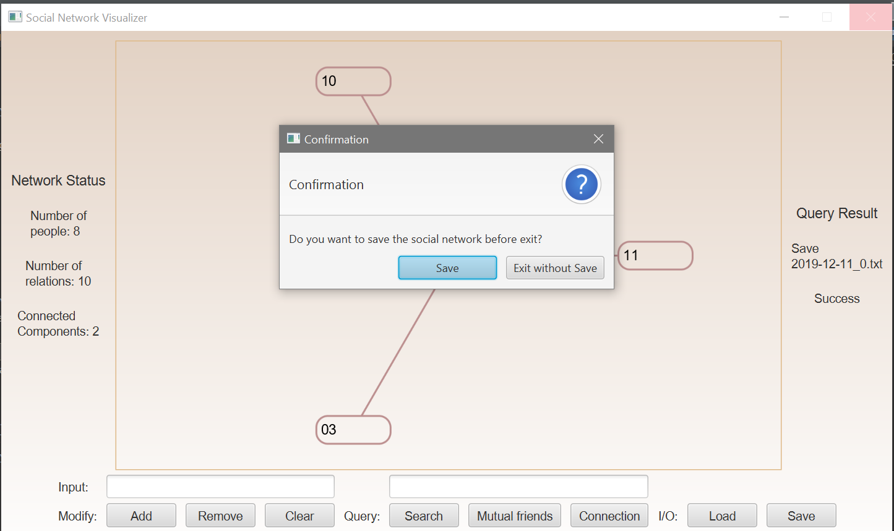
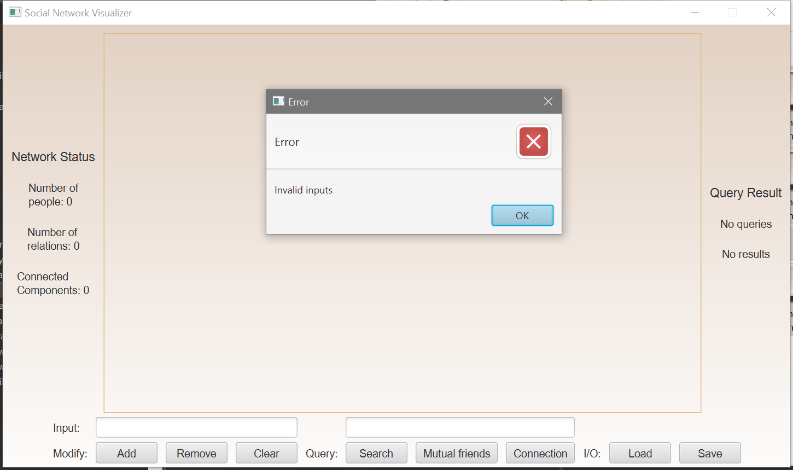

# social-network-visualizer

A JavaFX program that creates interactive social-network visualization with the given text input, saves, and restores session using text I/O. The program implements some basic graph algorithms, such as BFS, DFS, and Dijkstra's, to query, find connected components, and determine the shortest path between two users.

# Screen shots

- Empty network

- Adding nodes or edges

- Loading existing networks

- Saving current network

- Provide information based on user actions

- Check inputs and provide information based on type of errors

